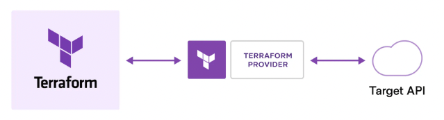
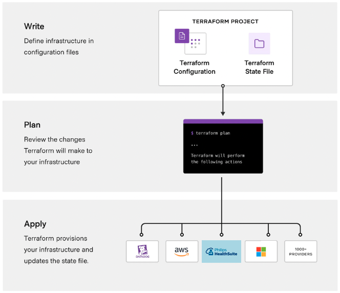
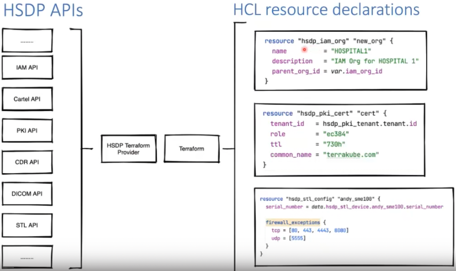
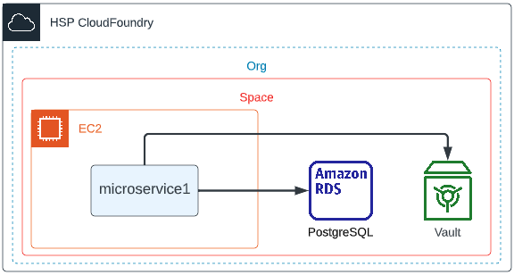
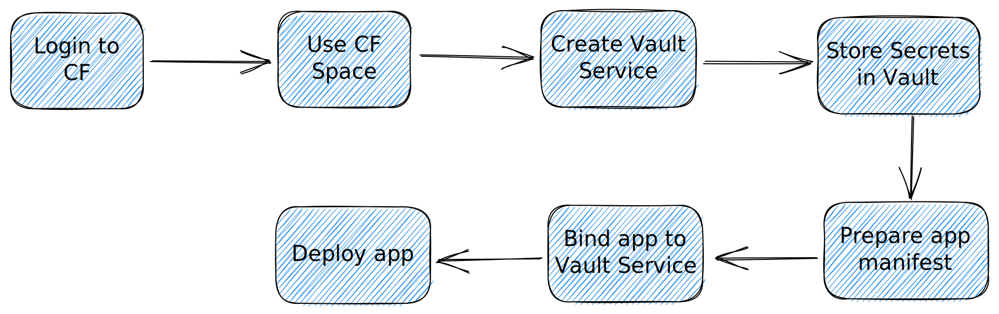
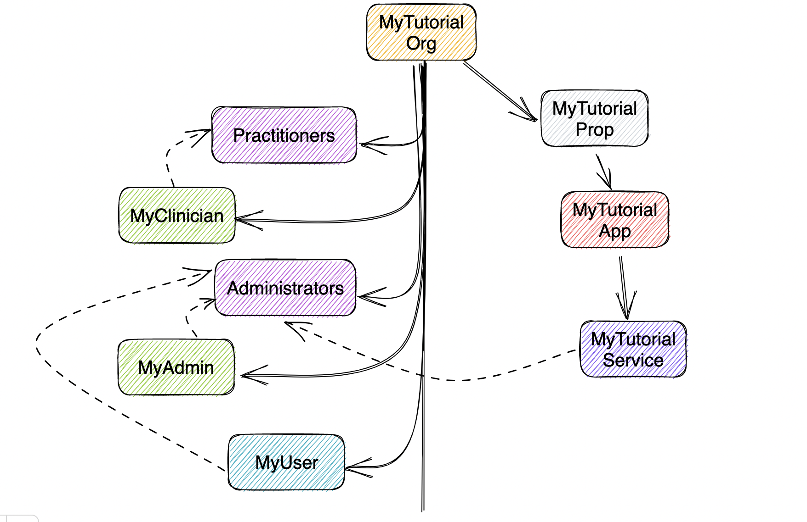

<!-- 
_color: white 
-->
# Terraform 101: Basics

Shinoj Prabhakaran
Andy Lo-A-Foe

---

<!--class: lead gaia-->
# Pre-requisites
- Install Multipass
- Create Multipass VM for Docker
- Create Multipass VM for Kubernetes 
- Install Terraform in Docker VM
- GitHub Account
- HSP CloudFoundry Account 

---

<!--class: lead gaia-->
# What will be covered?
- About Terraform
- Labs
    - Learn Fundamendals via Local Infrastructure
    - Build & Manage Docker Infrastructure
    - Build & Manage HSP CF Infrastructure

---

<!--class: lead gaia-->
# What will NOT be covered?
- Cloud Foundry Basics
- Microservice Architecture
- Docker Fundamentals
- Kubernetes Fundamentals
- Building Custom Terraform provider

---

<!-- _class: lead-->
# What is Terraform?
An infrastructure as code (IaC) tool that lets you build, change, and version cloud and on-prem resources safely and efficiently.
- 

---

<!-- _class: lead-->
# Why Terraform?

- Supports multi-cloud & hybrid infrastructure
- Migrate from other cloud providers
- Increase provisioning speed
- Improve efficiency
- Reduce risk
- Cover related to HSP AWS activities

---

<!-- _class: lead-->
# Terraform Workflow
- 

---

<!-- _class: lead-->
# Terraform HSP Provider
- 

---

<!-- _class: lead-->
# Lab 1: Fundamentals
In this lab, you will learn how to:
- Write your first script
- Init, Plan and Apply
- Using Providers & Resources
- Variables
- Outputs
- Destroy

---

<!-- _class: lead-->
# Lab 2: Deploy using Docker
In this lab, you will learn:
- Create a Docker Image
- Run a Docker Image
- Change Infrastructure
- Terraform Output
- Terraform State
- Terraform Auto-formatting

---

<!-- _class: lead-->
# Lab 3: Deploy using HSP CF
In this lab, you will learn:
- Create Vault Service Broker
- Deploy an App to CloudFoundry 
- Terraform Modules
- Terrform Saving states
- Terraform Graph
- Other useful commands

---

<!-- _class: lead-->
# Lab 3: Deployment Model

---

<!-- _class: lead-->
# Lab 3: Deployment Steps

---

<!-- _class: lead-->
# Lab 4: Build HSP Org Model
- 

---

<!-- _class: lead-->
# References
[HSP Terraform Techtalk](https://web.microsoftstream.com/video/2a5779a3-d8c9-4d90-8c4b-cbbe0d68b670)
[Terraform Tutorials](https://developer.hashicorp.com/terraform/tutorials)
[Docker Tutorials](https://www.docker.com/101-tutorial/)
[CloudFoundry Tutorials](https://web.microsoftstream.com/video/2ff6edb0-0bee-480d-ba49-4df7c94c3d8d)
[Kubernetes Tutorials](https://kubernetes.io/docs/tutorials/)
[AWS EKS Tutorials](https://docs.aws.amazon.com/eks/latest/userguide/getting-started.html)