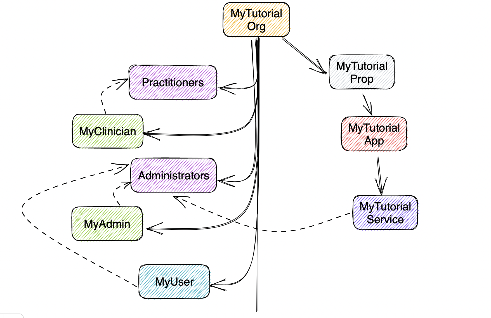

# Instructions
## 1. Structure terraform project
```bash
├── main.tf
├── modules
│   └── iam
│       ├── iam.tf
│       └── variables.tf
├── terraform.tfvars
└── variables.tf
```
## 2. Initialize terraform project
```bash
$ terraform init
```

## 3. Configure terraform variables
Add HSP IAM credentials that are required to create an organization model.

**NOTE:** DO NOT check in your credentials to git repo

## 3. Plan 
```bash
$ terraform plan
```

## 4. Apply to create the model
```bash
$ terraform apply -auto-approve
```

This will create the org structure as follows:



## 5. Destroy
```bash
$ terraform destroy -auto-approve
```